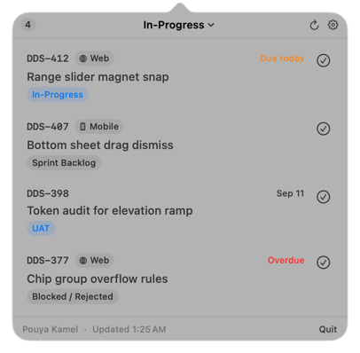

# Jirabar

A macOS menu bar client for a self-hosted Jira Server/Data Center board. It shows one column of
the board in a popover, tells you when a new issue lands in it, renders the full issue with its
comments, and moves an issue to another column without opening a browser.

It replaces keeping a Jira tab open all day.

Apple frameworks only. No cloud sync, no accounts, no analytics, no third-party packages.

<p align="center">
  
</p>

## What it does

- **One board column at a time**, chosen from a dropdown at the top of the panel. The columns are
  read from the Jira Agile API, so a board the team rearranges needs no update here.
- **Issue rows** carry the type icon, the key, the platform tag, the parent story as a tag, and
  the assignee's avatar, fetched with your token rather than left as a broken image.
- **A full issue view**: the description and the comment thread rendered as Jira sends them,
  the side fields (parent, epic link, components, labels, story points), and inlined attachment
  images.
- **Write back**: post a comment, edit your own, paste a screenshot to attach it, or move the
  issue to another board column. Jirabar never deletes a comment.
- **Notifications** when an issue newly arrives in the column you are watching. The existing
  contents are recorded silently the first time a column is opened, so the backlog never notifies.
- **Detach** the panel into a floating window that stays put instead of closing when focus moves.
- **Two-finger swipes**: sideways over the list steps through the board's columns, sideways over
  an open issue goes back to the list.
- **Failure states that tell the truth.** A rejected token, an unreachable host and a genuinely
  empty column are three separate screens with three different actions. None of them is an empty
  list.

## Requirements

- macOS 14.0 or later
- Xcode 26 (the app icon is an Icon Composer bundle) and [XcodeGen](https://github.com/yonaskolb/XcodeGen)
- A Jira **Server/DC** instance reachable from this Mac, and a Personal Access Token on it

Jira Cloud is not supported: this talks to `/rest/api/2` with a bearer PAT, which is the
Server/DC shape.

## Build and run

`project.yml` is the source of truth; the `.xcodeproj` is generated and gitignored.

```bash
xcodegen generate
xcodebuild -project Jirabar.xcodeproj -scheme Jirabar build
```

Then install the built bundle and launch it from `/Applications`, not from DerivedData:

```bash
APP=$(find ~/Library/Developer/Xcode/DerivedData -type d -name "Jirabar.app" \
        -path "*/Build/Products/Debug/*" | head -1)
pkill -x Jirabar; sleep 1
rm -rf /Applications/Jirabar.app && cp -R "$APP" /Applications/Jirabar.app
open -a /Applications/Jirabar.app
```

Signing is manual, pinned to one Mac's Apple Development certificate by SHA-1 hash. On another
Mac, replace `CODE_SIGN_IDENTITY` and `DEVELOPMENT_TEAM` in `project.yml` with your own, from
`security find-identity -v -p codesigning`. Ad-hoc signing works but makes the Keychain re-prompt
for the token on every launch, because the item's ACL then pins one exact build.

Tests:

```bash
xcodebuild -project Jirabar.xcodeproj -scheme Jirabar test
```

## Setup

1. Open Settings from the panel's footer.
2. Set the base URL of your Jira instance.
3. Create a Personal Access Token in Jira, under Profile then Personal Access Tokens, and paste
   it in. Press Test: it should answer with your own display name.
4. Set the project key and board id. The board id is the `rapidView` number in your board's URL,
   `.../secure/RapidBoard.jspa?rapidView=95&projectKey=DDS`.

The token goes into the login Keychain and nowhere else. It is never written to UserDefaults, a
plist, a log line or an error message. PATs expire, often after 90 days, so a rejected token is a
normal state with its own screen and a button to the token page.

## Privacy

Network calls, exhaustively: the Jira host you configure, for the REST endpoints the app needs.
Nothing else. The rendered description and comment views make no requests of their own, because
images are fetched with your token and inlined before the HTML reaches them. Nothing the app
stores leaves this Mac.

## Layout

```
project.yml            XcodeGen spec, the source of truth
Jirabar/
  App/                 AppKit: status item, popover, detached window, lifecycle
  Views/               SwiftUI: the panel, the issue view, the composer, settings
  Core/                No SwiftUI and no AppKit. The client, the models, the state machine.
  Resources/           Menu bar icon, app icon, Jira's own type and priority icons
JirabarTests/          CoreTests, StorageTests
_samples/              Screenshots, which are the visual spec
```

Anything testable lives in `Core/`, free of UI imports. `JiraClient` is the only thing that
touches the network.

DEBUG builds can force any state on screen without a server, which is how the failure screens get
photographed:

```bash
Jirabar.app/Contents/MacOS/Jirabar --qc-state=sample
```

Values: `sample`, `detail`, `empty`, `loading`, `needs-token`, `token-rejected`, `unreachable`,
`failed`. A forced state draws a yellow SAMPLE DATA banner, because the fixtures otherwise render
identically to a live board.

## Status

Working and in daily use. Known gaps are tracked in [PLAN.md](PLAN.md); user-visible changes are
in [CHANGELOG.md](CHANGELOG.md). Emoji reactions are built but the instance this was written
against serves no reactions API, so the picker hides itself when the read returns 404.

## Naming

This is an internal tool, and the name and the menu bar icon are only safe while it stays that
way. Both use Atlassian's trademark, which their policy does not permit, so both have to change
before any distribution outside the company.
